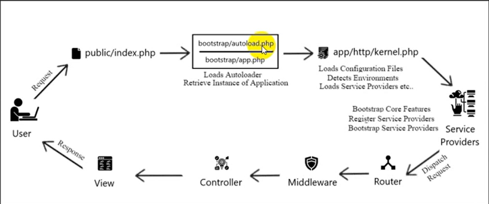

# php is a scripting language
## what is scripting language
- it is a programming language which run at runtime
- it doesn't need compiler, it uses interpreter
- it run line by line

# what is vendor?
direcroty contain all packages i have installed to use in my project

# php artisan
- it will call artisan file inside laravel project i am in and excute commands in it
- artisan file is designed to excute specific lines when i run php artisan serve for exmaple

# auto-load & psr-4
- psr-4 it is standard used for autoloading, in it we name classes with the same name as files

# request life cycle in php
- *that life cycle is very important because i will know every part of code work in any place and then can put code work right*
- ex: session start in middleware so in any file before it i can't write code to know how the user login for example


- any requests are directed to puplic/index.php هو دا المدخل الوحيد لل application بتاعي
- puplic/index.php is the only entry to all files in my laravel project, no one can access any file without passing by that file
- images, front end folders and any thing that will appear to the user must be in public folder

- app service provider
  - used for setup of my application 
  - contain all that i will include in every request like database, language
  - config/app.php: load service providers 
  - all registers methods for all service providers are excuted first then boot methods are excuted

```php
namespace App\Providers;

use Illuminate\Pagination\Paginator;
use Illuminate\Support\Facades\Validator;
use Illuminate\Support\ServiceProvider;

class AppServiceProvider extends ServiceProvider
{
    public function register(): void  // that register function for all service providers like AppServiceProvider, AuthServiceProvicer, BroadCastServiceProvicer, .... are excuted first
    
    // second after all thoser registers excuted boot start to be excuted
    {
        //
    }

    public function boot(): void
    {
        Validator::extend('filter', function ($attribute, $value,$params) {
            return !(in_array(strtolower($value),$params));
        }, "That value is prohibited!");
        Paginator::useBootstrap();
        // Paginator::defaultView('pagination.custom');
    }
}
```
- dispatch request
  - define what is the controller that will excute that request
- middleware
  - for check complete or not
  - authentication or prvillages
  - session_start here

- contoller: excute request
- view: return page to user

# service container
- container i store vaibles and objects 
- i use it to store object on it to use it over all my project, sometimes i should use same object over all project like when using obejct of connnection with database
- باختصار هو مخزن بخزن فيه شوية متغيرات هحتجها لاحقا
- to access object form service container
```php
$a = app('a');
$a->sum(2,2);
```

# static method 
- it is called for the class not object

```php
// if sum is a static method

// i call it like that
A::sum();

// can't say 
$a = new A();
$a->sum(); // xxxxxx
```

## facade class
- class gives me access to object with static method
- i must declare it in service container
- ex: 

```php
Route::get('/', function(){
    return view('welcome');
});
// that Route class is a facade class refere to router object in service container

// that is equal to 
// =============

$router = app('route');// that name of the object is declared in service container
$router->get('/', function(){
    return view('welcome');
});
```
- to know facade class refere to which object in service container
```php
// in vendor/laravel/src/framework/Illuminate/Support/Facades

namespace Illuminate\Support\Facades;
class Route extends Facade
{
    /**
     * Get the registered name of the component.
     *
     * @return string
     */
    protected static function getFacadeAccessor()
    {
        return 'router'; // mean Facade class refere to router object in service container
    }
}

```