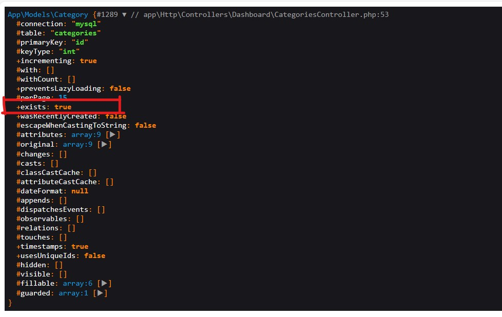

# update and create using save in laravel


if i call dd($contact)
that will print a lot of attributes for me one of them is exists, as shown in the above image
- if the value of that exist = true -> save() will update
- if the value of that exist = false -> save will create

save in laravel is designed to check exists, if it is true then update else create

```php
// create
$contact = new Contact;
$contact->name = 'Ken Hirata';
$contact->email = 'ken@hirata.com';
$contact->save();

// update
$contact = Contact::find(1);
$contact->email = 'natalie@parkfamily.com';
$contact->save();
```

# destroy
```php
Category::destroy($id);
// is equal to 
$category=Category::findorfail($id);
$category->delete();
```

# write complex quires using query builder in laravel 
```php
// SELECT * from categories where `id` <> $id and (parent_id is null or parent_id <> $parent_id)

// to write that (...) i must use grouping (closure function) over where
$parents=Category::where('id','<>',$id)
->where(function($query) use($id){ // we use that use to can use $id over closure function, i can't write that function($query,$id), because that is callback function, will be called with other function
    $query->wherenull('parent_id')
    ->orWhere('parent_id','<>',$id);
})
->get();
```

# php artisan storage:link
- that will go and execute array links in config/filesystems.php

```php
'links' => [
        public_path('storage') => storage_path('app/public'),
    ],
```

# advices for clean code
- code in if must be smaller, like that 

```php
public function uploadImage(Request $request)
{
    if (!$request->hasFile('image')) {
        return;
    }
    $file = $request->file('image');
    $path = $file->store('uploads', 'public');
    $data['image'] = $path;
}
```